# <h1 align=center> Tekton Kubernetes Angular CRUD

Aplicación Web desarrollada en el Stack MEAN para realizar las operaciones CRUD integrada con la herramienta Tekton para el despliegue e integración automáticos en un cluster de Kubernetes.

Esta demo es un acercamiento inicial que permite crear, leer, actualizar y borrar registros de una base de datos por medio de llamados al API de Express que está conectado con la base de datos MongoDB.

Con Tekton aseguramos el despliegue en un cluster de Kubernetes con la opción de realizar cambios que se vean reflejados en el entorno de producción en el menor tiempo posible con las respectivas pruebas, facilitando el Test-Driven Development (TDD) y las metodologías ágiles como DevOps.

El repositorio se encuentra organizado en dos submodulos, Tekton_Back y Tekton_Front, cada uno con la respectiva parte de la aplicación.

## 📑 Tabla de contenido

1. [Arquitectura](#-arquitectura)
2. [Requisitos](#-requisitos)
3. [Hands On!](#-hands-on)<br>
   3.1 [Plugins](#-instalar-o-actualizar-los-plugins-necesarios-de-ibm-cloud-cli)<br>
   3.2 [Despliegue de la base de datos](#-desplegar-la-imagen-de-nuestra-base-de-datos)<br>
   3.3 [Depliegue de la aplicación con Tekton](#-desplegar-nuestra-aplicación-con-tekton)<br>
4. [Extras: Private Worker](#-extras:-private-worker)
5. [Referencias y documentación útil](#referencias-y-documentación-útil)

## 📦 Arquitectura

<p align=center>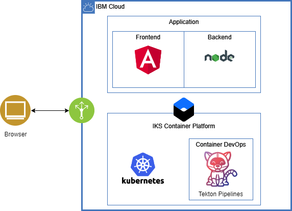</p>

## Requisitos

- Tener un servicio de **[Kubernetes Cluster](https://cloud.ibm.com/kubernetes/clusters)** disponible en la cuenta IBM Cloud. Para cuentas Lite este servicio está disponible por 30 días.
- :cloud: [IBM Cloud CLI](https://cloud.ibm.com/docs/cli?topic=cloud-cli-getting-started&locale=en)
- :whale: [Docker](https://www.docker.com/products/docker-desktop)
- [kubectl](https://kubernetes.io/docs/tasks/tools/install-kubectl/). La version de esta herramienta debe ser compatible con la version de IKS que se desplegó en la cuenta.
- [TypeScript](https://www.typescriptlang.org/#download-links)
- [Angular CLI](https://cli.angular.io/)
- [Node y NPM](https://nodejs.org/en/)

## :hand: Hands On!

### Instalar o actualizar los plugins necesarios de IBM Cloud CLI.

Reemplazar `install` con `update` si es el caso:

```sh
ibmcloud plugin install kubernetes-service
ibmcloud plugin install container-registry
```

### Desplegar la imagen de nuestra base de datos.

Para este caso vamos a desplegar la base de datos en un pod separado a nuestra aplicación para tener mayor control sobre ella y su aseguramiento, por lo que no usaremos Tekton para esta imagen sino que lo haremos de forma manual. Con este fin, necesitaremos configurar nuestra CLI.

- Iniciar sesión en nuestro terminal de comandos:

  `ibmcloud cr login`

  **Importante**: Tener en cuenta la región que aparece en pantalla, ya que tomará parte de los pasos siguientes.

- Crear espacio de nombres:

  `ibmcloud cr namespace-add <namespace>`

  Este espacio de nombres tambien formará parte de los comandos siguientes. Se puede comprobar el nombre en cualquier momento usando el comando: `ibmcloud cr namespaces`

- Descargar la imagen de MongoDB del registro Docker Hub:<br/>
  Para descargar la imagen oficial de MongoDB, almacenada en el registro de imagenes Docker Hub, utilizar el comando:

  `docker pull mongo:latest`

- Cambiar tag de la imagen para que sea compatible con la region y el espacio de nombre de nuestro IKS:<br/>
  `docker tag mongo:latest <region>/<namespace>/mongo`

- Subir imagen a Container Registery:
  `docker push <region>/<namespace>/mongo`
- Configurar el plugin kubernetes-service:

  `ibmcloud cs cluster config --cluster <nombre_cluster>`

  Si no conocemos el nombre de nuestro cluster podemos utilizar el comando `ibmcloud cs clusters` y seleccionar el que vayamos a utilizar

- Desplegar la imagen en nuestro Cluster:

  `kubectl run mongo --image=<region>/<namespace>/mongo`

- Exponer el Pod creado:

  `kubectl expose deployment/mongo --type="NodePort" --port=27017`

  Para poder enlazar la imagen creada con nuestra aplicación necesitamos la IP y el puerto generado en el paso anterior, para eso ejecutamos el comando:

- Puerto: `kubectl describe service mongo`

- IP: `ibmcloud cs workers --cluster <nombre_cluster>`

  Con la IP y el puerto editamos el archivo database.ts ubicado en la carpeta **Tekton_Back/src**, modificando las lineas de conexión con la base de datos, como en la siguiente imagen:

  <p align=center>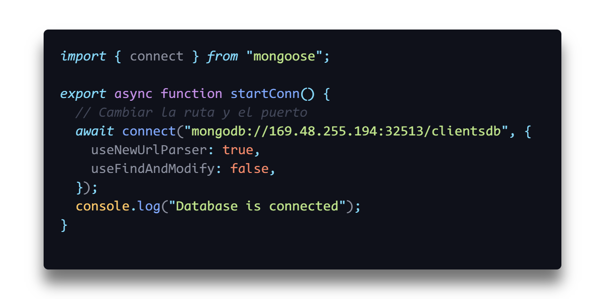</p>

###  Desplegar nuestra aplicación con Tekton

Para desplegar nuestra aplicación de Backend, nos dirigimos al repositorio Tekton_Back, que se encuentra enlazado como submodulo, donde podemos encontrar la carpeta .tekton, la carpeta scripts, el archivo deployment.yml y el archivo Dockerfile, recursos que utilizará Tekton para realizar el despliegue.

**Nota**: El proceso para desplegar nuestra aplicación con Tekton es el mismo tanto para Backend como Frontend.

<p align=center>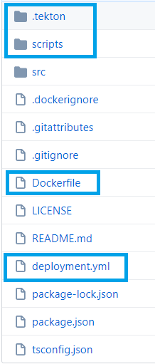</p>

1. Nos dirigimos a la página de [IBM Cloud ☁️](https://cloud.ibm.com), iniciamos sesión y damos clic a la sección de DevOps en el panel lateral izquierdo, como se ve en la imagen.

<p align=center>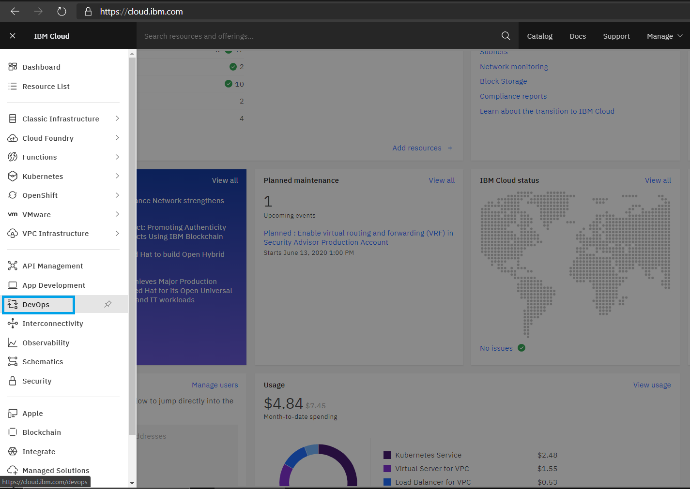</p>

2. Procedemos a crear un nuevo toolchain(cadena de herramientas) seleccionando el botón create toolchain.

**Importante**: Revisar que la localización de nuestra toolchain sea la misma a nuestro cluster de Kubernetes

En la pantalla de creación seleccionamos el recuadro Build your own toolchain en la sección de Other Templates.

<p align=center>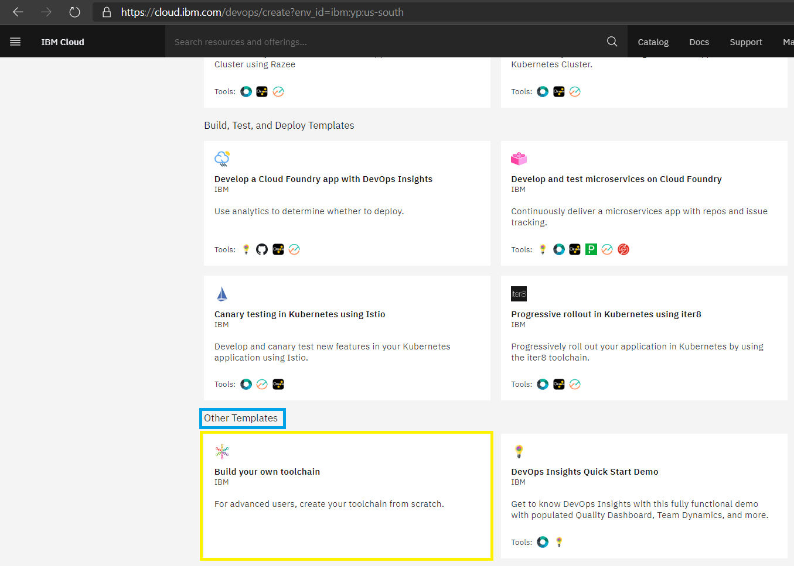</p>

3. Escogemos el nombre de nuestra toolchain, la región de nuestro cluster y crear.

   Nos debe redirigir a la siguiente pantalla.

<p align=center>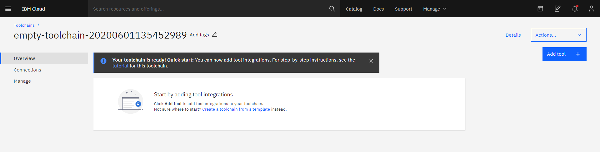</p>

4. Añadimos las siguientes tools, con la configuración mostrada en las imágenes:

- GitHub. Repositorio utilizado`https://github.com/MGsus/Tekton_Back`

 <p align=center>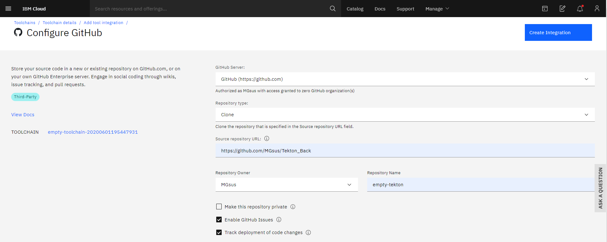</p>

- Delivery Pipeline.

Escoger en tipo de pipeline, Tekton

 <p align=center>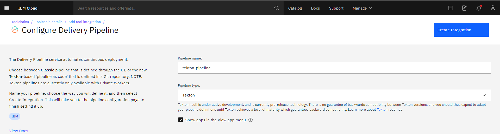</p>

Así deberá quedar el Toolchain:

 <p align=center>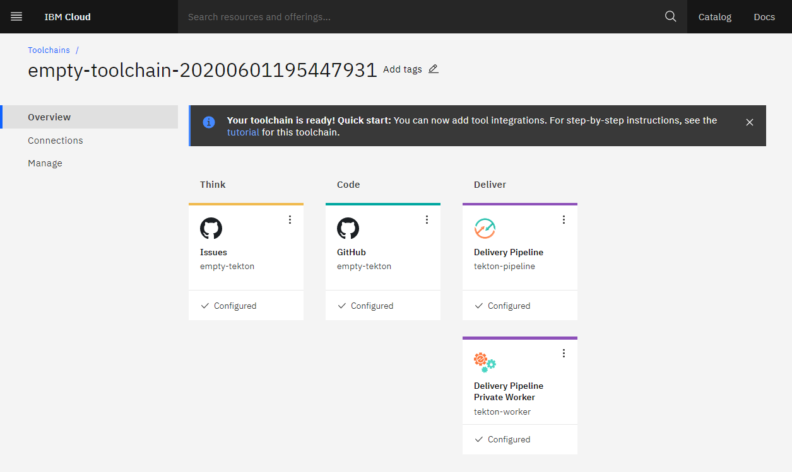</p>

Ahora debemos enlazar el repositorio de la aplicación y el Worker que vamos a usar, con el Pipeline creado en el paso anterior. Para eso ingresamos a nuestro Delivery Pipeline.

En el menú Definitions agregamos nuestro repositorio, como ya se encuentra enlazado nos aparecerá como única opción, y nos reconocerá la carpeta .tekton.

### <p align=center>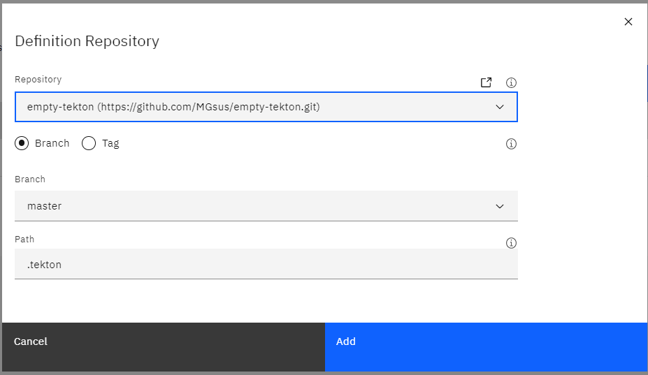</p>

Una vez añadido deberá aparecer la definición de nuestro repositorio y guardamos los cambios.

Ahora vamos a la pestaña de Worker, donde seleccionaremos el worker público que provee IBM Cloud.

**Importante: para utilizar un Private Worker, encontrará los pasos en la sección opcional, Private Worker.**

### <p align=center>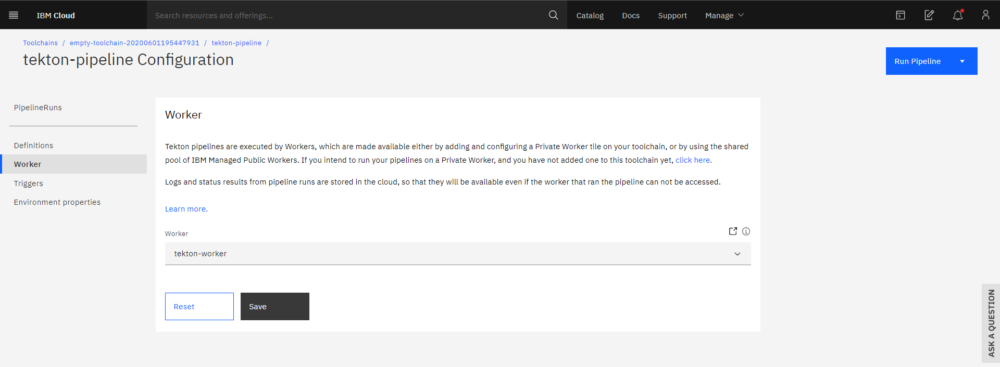</p>

Guardamos los cambios y seguimos a la siguiente pestaña Triggers.

Acá configuraremos la forma en la que nuestro pipeline va a iniciar. En Add Trigger tenemos cuatro opciones, para este Hands On crearemos Git Repository y Manual.

- Git Repository: Seleccionamos nuestro repositorio, la rama que queremos desplegar y las acciones que ejecutarán nuestro pipeline. En la siguiente imagen se muestra la configuración para esta guía.

### <p align=center>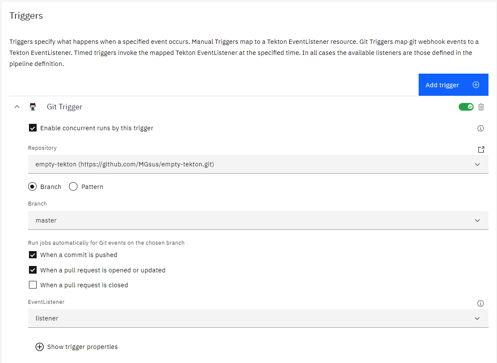</p>

- Manual Trigger: habilitaremos un trigger manual para poder ejecutar nuestro pipeline aunque no tengamos cambios nuevos en nuestra aplicación.

### <p align=center>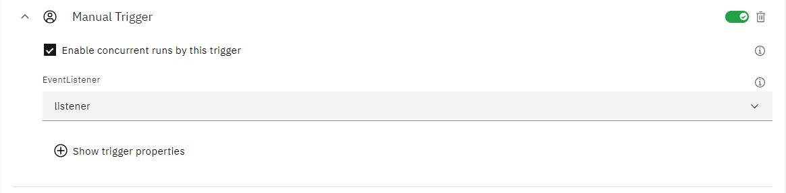</p>

Guardamos los cambios y pasamos a las variables o propiedades de entorno.

Añadimos 3 propiedades de Texto y una propiedad segura, como se muestra en la imagen, asignando los valores según la configuración de nuestro cluster y la API Key creada anteriormente.

### <p align=center>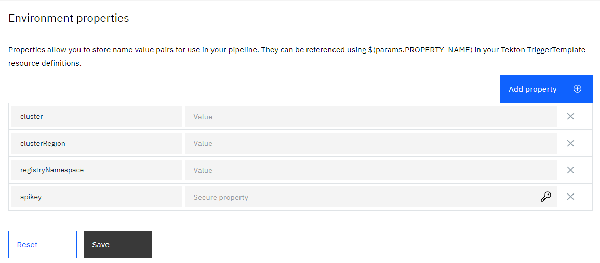</p>

Una vez finalizado esto podemos ir a la pestaña PipelineRuns y ejecutar manualmente un nuevo pipelineRun.

Finalmente podemos ir a nuestro Pipeline y ejecutar manualmente un nuevo pipelineRun.

### <p align=center>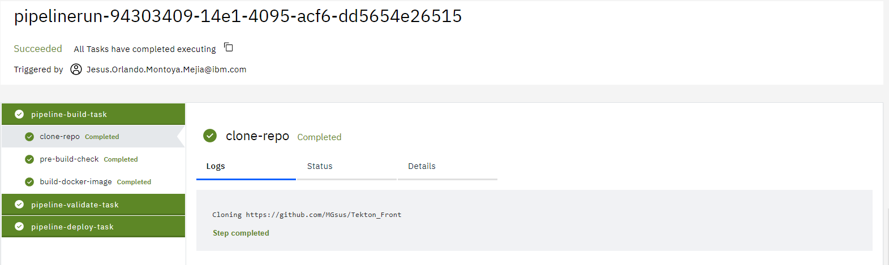</p>

---

## Extras: Private Worker

Para utilizar un private worker en lugar del público ofrecido por IBM, necesitamos generar una Service ID API Key la cual debemos guardar en el servicio de [IBM Key Protect](https://cloud.ibm.com/docs/ContinuousDelivery?topic=ContinuousDelivery-integrations#keyprotect) para poder usarla más adelante.

Debemos añadir una nueva tool, Delivery Pipeline Private Worker. Colocamos nuestra ID API Key y el nombre que deseemos y damos clic en crear herramienta.

### <p align=center>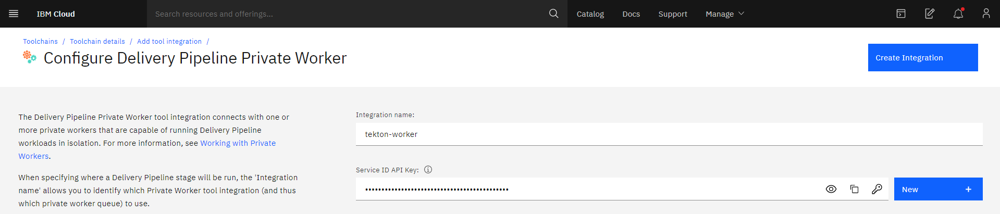</p>

En el dashboard de Tekton nos aparecerá un error.

### <p align=center>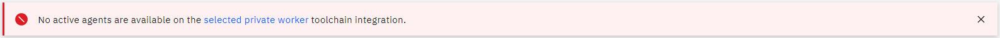</p>

Esto ocurre porque no hemos enlazado el worker a nuestro Cluster de K8s. Para realizar esta integración vamos a la pantalla principal de nuestro toolchain y selecionamos nuestro worker privado.

Donde podremos ver que no hay ningún Worker en nuestra Worker Pool.

Para cambiar esto vamos al apartado de Getting Started donde están todos los pasos para añadir nuestro Worker privado, necesitaremos el API key generado anteriormente, si no lo tiene puede generar otro API key y utilizar el nuevo.

Nos aparecerán los comandos que debemos utilizar para añadir, remover o actualizar un Worker privado en nuestro cluster. **Importante**: para eso debemos ingresar a nuestro cluster por el CLI de IBM Cloud. Acá una guía de como hacerlo: [Ingresar a nuestro cluster K8s](https://cloud.ibm.com/docs/containers?topic=containers-cs_cluster_tutorial#cs_cluster_tutorial_lesson1)

### <p align=center>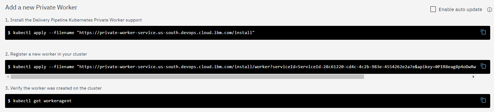</p>

Así debera aparecer nuestra Worker Pool una vez configurado nuestro Worker

### <p align=center>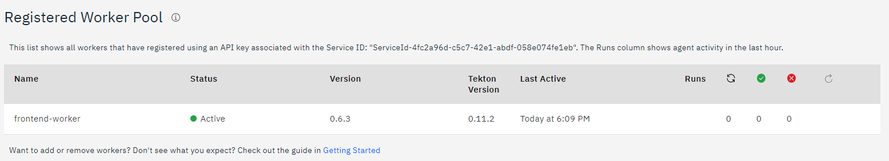</p>

Ya con esto podemos ir al Dashboard de Tekton y ejecutar manualmente un pipelineRun.

## Autores

Equipo IBM Cloud Tech Sales Colombia

**Copyright 2020 IBM**
